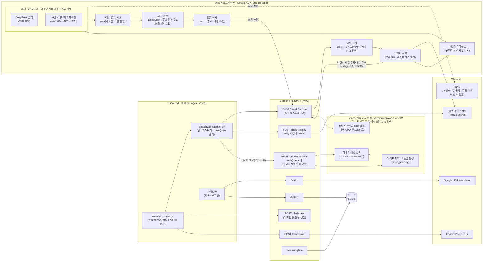
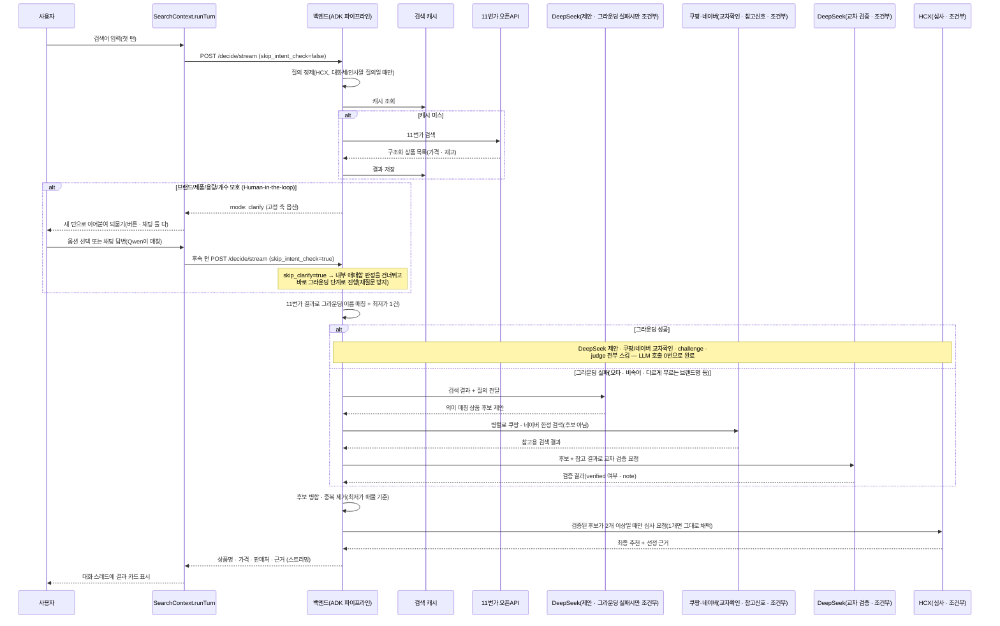
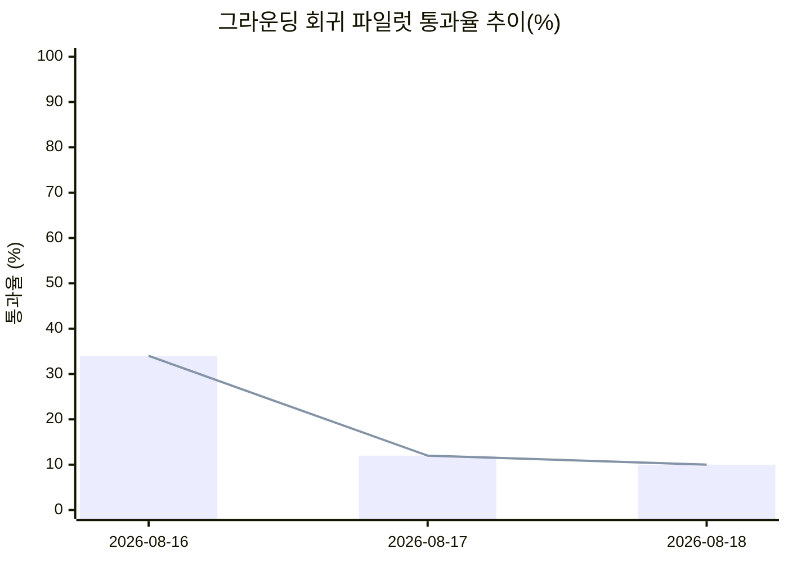

# αlpha Pick

alpha-pick-jet.vercel.app
---

## 1️⃣ 프로젝트 개요

### 프로젝트명 및 한 줄 소개

**αlpha Pick** — 하나의 검색어를 여러 AI 에이전트가 각자 조사해 제안하고, 별도의 심사 에이전트가 근거를 비교해 하나의 답으로 압축해주는 멀티에이전트 쇼핑 가격비교 서비스.

### 프로젝트 개요도

> 2026-08-20 다나와→11번가 전환 이후 구조. 메인 결정 파이프라인(`/decide/stream`)과
> AI 상세검색(`/decide/clarify`) 둘 다 다나와 직접 스크래핑을 배제하고 11번가 공식
> 오픈API로 검색한다 — 메인 파이프라인은 그라운딩이 성공하면 제안(DeepSeek)·교차
> 검증(DeepSeek)·심사(HCX)·쿠팡/네이버 교차확인까지 전부 조건부로 건너뛰어 "행복
> 경로"는 LLM 호출이 사실상 0번이다. `/decide/clarify`는 처음엔 이 전환 범위 밖이라
> 남아있었는데(다나와 Crawl-delay 10초 때문에 체감 지연의 주 원인이었다), 뒤늦게
> 함께 11번가로 옮겼다 — 동시에 프론트가 첫 라운드마다 이 엔드포인트를 미리 불러보던
> 사전 호출도 없앴다(`/decide/stream` 내부의 `run_clarify()` 안전망이 이미 완전히
> 동일한 11번가 기반 facet 추출을 수행해 순수 중복 호출이었다). 다나와 코드는
> `/decide/danawa-only`(LLM 미사용 실험 경로)와 핸드폰 기종처럼 표본이 특정 생태계로
> 쏠릴 때의 보충 검색(`_ecosystem_name_pool`)에만 남아있다. 2026-08-21부터는
> "groq" 에이전트 슬롯(정제·심사·스타일가이드·카테고리분류·OCR정제)이 실제로
> 호출하는 모델도 Groq에서 기업이 제공한 Naver Cloud CLOVA Studio(HCX-005)로
> 바뀌었다 — 내부 식별자("groq")는 그대로 유지하고 호출 대상만 교체했다(과거
> "gemini"→Groq 전환과 같은 패턴). DeepSeek(교차 검증)·Qwen(제안 폴백 일부)은
> 이번 전환 범위 밖으로 남겨 교차 검증의 제공자 독립성을 유지한다. 자세한 배경은
> [주요 의사결정 사항](#주요-의사결정-사항) 참고.

### 적용 기술 스택

| 영역 | 스택 |
| --- | --- |
| Frontend | React 18, Vite 6, TypeScript, Tailwind CSS v4, Framer Motion(`motion`), React Router (HashRouter) |
| Backend | FastAPI, Python, httpx, PyJWT |
| 멀티에이전트 오케스트레이션 | Google ADK(`SequentialAgent`/`ParallelAgent`), LiteLLM |
| AI / 제안 · 검증 · 심사 | 11번가 구조화 후보(그라운딩 성공 시 확정, LLM 미사용) + DeepSeek(그라운딩 실패시만 조건부 폴백 제안) / DeepSeek — 교차 검증(challenge, 후보가 전부 구조화 출처면 건너뜀) / HCX-005(Naver Cloud CLOVA Studio, "groq" 슬롯) — 최종 심사(judge, 후보가 1개면 건너뜀) |
| 검색 | 11번가 오픈API(ProductSearch, 구조화 가격/재고) + 정규화 질의 기반 검색 캐시 — 메인 파이프라인(`/decide/stream`)·AI 상세검색(`/decide/clarify`) 모두 이걸 쓴다. 0건일 때만 Tavily 비제한 검색으로 상품명을 발견해 재검색(최후 폴백), 쿠팡/네이버 교차확인 신호도 Tavily |
| 다나와 실측 가격 연동 | `/decide/danawa-only`(LLM 미사용 실험 경로) 전용 + AI 상세검색의 핸드폰 기종처럼 특정 생태계로 표본이 쏠릴 때의 보충 검색(`_ecosystem_name_pool`) — 다나와 직접 검색/상세페이지 페치(`httpx` + `BeautifulSoup4`/`lxml`), 내부 AJAX 엔드포인트를 통한 최저가 판매처 브릿지 URL 해석. 메인 결정 파이프라인·AI 상세검색의 주 검색 경로는 둘 다 11번가로 대체돼 더 이상 다나와를 안 씀(`_DanawaFetchNode`는 참고용으로 코드에만 남음) |
| Human-in-the-loop | DeepSeek가 상품명 목록에서 facet(라벨 자유, 상호 교차 필터링)을 추출 — `/decide/clarify`와 ADK 파이프라인 내부 안전망(`run_clarify`) 두 진입점이 하나의 공유 추출 파이프라인을 쓰고, 둘 다 11번가 검색 결과를 입력으로 받는다. 사용자 페르소나(로그인 선호도 + 세션 선택)도 두 진입점에 동일하게 반영된다. 되묻는 질문 문장은 Qwen이 실시간 생성(`/clarify/ask`) |
| 이미지 인식 | Google Cloud Vision (텍스트 추출) → HCX-005 (정제 · 검색어 추출, "groq" 슬롯) |
| 인증 | Google / Kakao / Naver OAuth2 + JWT 기반 세션 |
| 저장소 | SQLite (검색 기록 · 자동완성 인덱스 · 검색 캐시) |
| 배포 | Docker, nginx, certbot, AWS GPU 인스턴스, nip.io(Backend) / GitHub Pages, Vercel(Frontend), GitHub Actions(CI) |

### 주제 선정 배경

쇼핑을 위해 여러 플랫폼 탭을 오가며 가격을 직접 비교해야 하는 번거로움에서 출발했다. 단순히 최저가를 나열하는 비교 서비스가 아니라, "왜 이 상품인지" 근거를 함께 제시하는 서비스를 목표로 했고, 하나의 LLM에만 의존할 경우 생기는 편향·환각 문제를 줄이기 위해 **여러 모델이 각자 조사해 제안하고, 별도 모델이 심사하는 멀티에이전트 구조**를 채택했다.

### 목표 및 기대효과

- 여러 쇼핑몰을 직접 비교하는 시간을 줄이고, 근거가 붙은 단일 추천으로 의사결정을 단순화
- 단일 모델 호출 대비, 여러 모델의 교차 검증을 통해 추천의 신뢰도를 높임
- 텍스트뿐 아니라 상품 사진(OCR)으로도 검색이 가능해 입력 장벽을 낮춤

### 팀원 구성 및 역할 분담

| 팀원 | 주요 역할 |
| --- | --- |
| parkminsung45 | 백엔드 멀티에이전트 토론 엔진, 검색 품질(Tavily 연동/필터링), 소셜 로그인, 배포(AWS/Docker/nginx), 프론트엔드 UI/UX 전반 |
| tmdals3000 | 검색어 자동완성(cold-start) 기능, 멀티턴 대화 기능 |
| lou0-ux | OCR 텍스트 추출 파이프라인(Google Vision + Groq 정제) |
| Seojeong Woo | 서버 인스턴스 관리 , 데이터베이스 구축, 리서치 |

### 시간순 변경 이력

날짜는 실제 커밋 기준(`git log`). 아래는 그날의 핵심만 압축한 타임라인이고,
"왜 그렇게 했는지"의 근거는 바로 아래 [주요 의사결정 사항](#주요-의사결정-사항)과
[문제 해결 내역](#문제-해결-내역-troubleshooting)에 항목별로 자세히 남아있다.

| 날짜 | 도입 / 변경 / 개선 |
| --- | --- |
| 2026-08-04 ~ 06 | Figma Make로 뽑은 포트폴리오 템플릿(Cherry-Pick)을 실 프로젝트 구조로 전환(→ Étiquette 리브랜드). FastAPI 백엔드 스캐폴딩 + GPT·Gemini·DeepSeek 멀티에이전트 구매 의사결정 엔진 최초 구현 |
| 2026-08-07 | Google·Kakao·Naver 소셜 로그인, 계정별 검색 기록 사이드바, OCR(Google Vision + Gemini 정제) 이미지 검색 파이프라인 추가. 검색 소스를 네이버쇼핑 → Google Merchant Center로 교체. AWS GPU 인스턴스 + nip.io 기반 배포 최초 구축 |
| 2026-08-08 ~ 09 | "How We Curate"(멀티에이전트 토론 흐름 설명) 섹션, README 프로젝트 리포트 섹션 신설 |
| 2026-08-10 | 다나와 실측 가격 어댑터 최초 구현(판매처별 가격표 파싱, STEP 1~5 라이브 검증) · 쿼리 정규화 검색 캐시 도입 · `fusion.dedup` 후보 병합 가드(가격 호환성 + 이름 유사도) 추가 · Étiquette → αlpha Pick 리브랜드 |
| 2026-08-11 | 다나와 A등급(구매 링크 생성 가능) 후보를 judge 풀에 직접 승격(PART 4-2) · 동일 상품 판정 기준을 판매처+가격 → 상품명으로 전환(STEP 6) · **Google ADK 기반 역할 분리 멀티에이전트 파이프라인 + 의미 기반 검색 캐시 도입(현재 아키텍처의 골격)** · Human-in-the-loop 최초 도입 |
| 2026-08-12 | 카테고리 기반 HITL 축 최적화(Gemini 16종 분류로 용량/개수 관련성 판정) · 다나와 최저가 URL 해석(브릿지 엔드포인트) + 대화형 HITL(LLM이 되묻는 문장 생성) 추가 |
| 2026-08-13 | "gpt" 에이전트 슬롯을 OpenAI → Qwen(DashScope)으로 전환 · 완전 무관 후보뿐일 때의 relaxed fallback 최초 추가 · ChatGPT식 멀티턴 대화 스레드(`ChatTurn`)로 프론트 전환 · `skip_clarify`로 재질문 반복 버그 수정 · 죽은 코드/미사용 npm 의존성 1차 정리 |
| 2026-08-14 | Gemini·Claude → Groq 무료 API 전면 전환 · `/decide/clarify`와 ADK 내부 안전망의 facet 추출 로직 통합 · "용기형태" facet 구매유형 오분류 수정 · 쿠팡 교차 확인(challenge 3번째 그라운딩 신호) 추가 · 깨진 쿠팡 구매링크 노출 버그 3건(연쇄 원인) 수정 · 액세서리(핸드폰 케이스 등) 검색 품질 개선 · 대규모 죽은 코드 정리 · README 대폭 갱신 |
| 2026-08-16 | relaxed fallback을 challenge 재검증으로 게이팅해 하드닝(그라운딩 우회 경로 차단) · `Decision.verified` 필드 추가로 최종 응답의 그라운딩 검증 여부를 API 전체에 노출 · 네이버쇼핑을 쿠팡과 동일 패턴의 2번째 소프트 교차 확인 소스로 추가 · 알려진 상품 세트 기반 그라운딩 정확도 회귀 스크립트(`scripts/grounding_regression.py`) 추가 · 다나와 실측가 후보에 검색어 관련성 가드 추가(아이폰→아이패드 오추천 버그 수정) · facet crossfilter로 이미 좁혀진 축은 되묻지 않도록 수정(불필요한 clarify 다발 버그) · 다나와 가격비교 페이지 자체를 최종 후보로 받아들이던 버그 수정 |
| 2026-08-17 | 다나와 가격비교 페이지 필터를 도메인 기반으로 일반화(모바일 URL 변형 누락 대응) · 그라운딩 회귀 스크립트에 실행 전 제공자 헬스체크 + 도중 연속 실패 시 즉시 중단 안전장치 추가 · README에 그라운딩 회귀 실험 이력을 표+그래프로 자동 갱신하는 기능 추가 · 배포 저장소를 Prototype-1- 하나로 일원화(구 Alpha-pick00.github.io가 비공개/개명되며 배포 대상에서 제외, Pages 활성화 + 누락 환경변수 설정 + 죽은 배포 터널 재기동) · 안전장치의 쿼터 소진 감지가 파이프라인 내부 예외 삼킴에 뚫리는 문제 발견 후 문자열 매칭 → 연속 실패 기반 헬스체크 재확인 방식으로 재설계 |
| 2026-08-18 | 배포 터널 재소진 + 구 GitHub Pages URL 404 확인 후 터널 재기동·`VITE_API_URL` 갱신·재배포로 복구 · "gemini" 슬롯 기본 Groq 모델을 llama-3.3-70b-versatile → gpt-oss-20b로 교체 · 프론트엔드를 Vercel에도 배포하고 백엔드를 기존 AWS 인스턴스에 최신 코드로 재배포(저장소 재동기화, nginx+TLS를 새 인스턴스 IP로 재발급), CORS에 Vercel 도메인 추가 |
| 2026-08-19 | 취향 주도 카테고리(패션의류/잡화 등)에 스타일 가이드 응답 모드 추가(검증된 후보를 스타일별로 그룹핑) · 토큰 사용량 최적화(clarify facet 추출 가드, classify_category 모델 재배정) · 저장소 전반 죽은 코드/미사용 설정·의존성 정리(백엔드·프론트엔드) · README 정리 |
| 2026-08-20 | **메인 결정 파이프라인의 검색 백엔드를 Tavily+다나와 도메인 한정 → 11번가 오픈API로 전면 교체**(다나와 AWS IP 403 차단/Crawl-delay 불안정성 회피) · 제안 LLM을 Qwen/Groq/DeepSeek 3개 병렬 → 11번가 그라운딩 실패시만 조건부 호출되는 DeepSeek 1개로 축소, 그라운딩 성공 시 challenge/judge/쿠팡·네이버 교차확인까지 연쇄로 스킵(행복 경로 LLM 호출 0번) · 질의 정제(refine)를 대화체/인사말 질의(`looks_conversational_query`)에만 조건부로 재도입 · AI 상세검색 "카테고리" 되묻기를 프롬프트+코드 이중으로 제거 · AI 상세검색 facet 전체 선택 시 자동 제출, 드릴다운 질의 표시 정리, 대화체 질의 정제(`groq.refine_query`) 추가 · **뒤이어 AI 상세검색(`check_clarify_facets`)도 11번가로 마저 전환**(다나와 Crawl-delay가 여전히 남아있던 체감 지연의 주 원인이었음), 프론트가 첫 라운드마다 미리 불러보던 `/decide/clarify` 사전 호출을 제거(`/decide/stream` 내부 `run_clarify()`가 이미 동일한 11번가 기반 판정을 수행해 중복이었음), 사용자 페르소나(facet 순서 반영)를 `/decide/stream` 경로까지 관통시켜 사전 호출 제거로 인한 기능 손실 방지 |
| 2026-08-21 | 기업에서 제공받은 Naver Cloud CLOVA Studio(HCX) API로 "groq" 에이전트 슬롯(정제·심사·스타일가이드·카테고리분류·OCR정제·AI 상세검색 정제)의 실제 호출 대상을 Groq → HCX-005로 교체(내부 식별자는 유지, 자격증명은 `HCX_API_KEY`/`HCX_API_BASE` 신규 도입) · `minsung` 브랜치(죽은 코드 정리 + README 아키텍처 갱신)를 `main`으로 PR |

### 주요 의사결정 사항

- **검색 데이터 소스**: Google Merchant API → Tavily 검색 API + 국내 리테일러 15곳 도메인 한정
- **판단 구조**: 단일 모델 호출 → ChatGPT · Gemini · DeepSeek 3개 병렬 제안 + Claude 심사의 4단계 구조
- **Google 로그인 방식**: 공식 iframe 버튼 → `google.accounts.oauth2` 팝업 + 커스텀 버튼
- **CORS 정책**: origin을 알려진 도메인으로만 제한(와일드카드 금지)
- **검색 기록 저장**: 로그인 시 서버(SQLite), 비로그인 시 로컬(localStorage)로 분기
- **판단 구조 재설계**: 단일 호출 구조를 Google ADK 기반 정제 → 검색 → 제안(3모델 병렬) → 병합 → 교차 검증 → 심사 파이프라인으로 분리
- **후보 병합 기준**: 필드별(가격 · 판매처 · URL) 독립 다수결 → 최저가 매물 하나에서 세 필드를 함께 채택
- **Human-in-the-loop 도입 방식**: ADK 내부 pause/resume 대신 앱 레벨 무상태 재실행 채택 — 브랜드 · 제품 · 용량 · 개수가 모호하면 파이프라인을 멈추고 한 축씩 되묻는다
- **카테고리 기반 HITL 축 최적화**: 검색어를 16개 대분류로 분류해, 카테고리별로 용량 · 개수 축의 관련성을 다르게 판정(예: 식품 중 음료만 용량 유효)
- **다나와 실측 가격 직접 연동**: 다나와 검색결과/상세페이지를 직접 페치해 A등급 판매처 실측가 확보, 대조 가능하면 `price_source`를 `danawa_offer`로 표시
- **다나와 가격비교 페이지 → 구매 URL 변환**: 최종 URL이 다나와 페이지면 내부 AJAX 엔드포인트로 최저가 브릿지 URL을 조회해 치환
- **검색 도메인 15곳 → 다나와로 축소**: 리테일러마다 페이지 구조가 달라 스니펫 파싱 시 오매칭이 있어, 가격비교 사이트 하나로 좁힘(에누리는 어댑터 없이 노출만 되던 상태라 함께 제외)
- **Human-in-the-loop 이원화**: 고정 4축(GPT, Tavily 결과 기반) + AI 상세검색 facet(DeepSeek, 다나와 결과 기반) 병행 — 짧은 질의는 facet을 먼저 시도하고 못 찾으면 고정 축으로 폴백
- **대화형 UI로 통합**: 프론트를 `ChatTurn` 배열 기반 멀티턴 스레드로 재구성, 브랜드/facet/축 선택을 전부 새 턴으로 통일
- **AI 오케스트레이션과 다나와 통합 병합**: 두 갈래로 개발되던 기능을 ADK 파이프라인 하나로 병합, `skip_clarify` 플래그로 재질문 회귀 수정
- **"gpt" 슬롯을 GPT → Qwen으로 교체**: 내부 식별자(`agent="gpt"`, 파일/함수명)는 유지, 호출 모델만 DashScope Qwen으로 교체. 프론트 표시 이름만 "Qwen"으로 변경
- **Gemini · Claude → Groq로 교체**: `agent="gemini"` 식별자는 유지, 호출 모델만 교체. refine은 `gpt-oss-20b`, judge는 `gpt-oss-120b`, categorize/OCR정제/propose "gemini" 슬롯은 `llama-3.3-70b-versatile`. 검색 결과 스니펫을 500자로 잘라 담도록 `format_results_block` 조정
- **다나와 A등급 실측가 주입을 ADK 파이프라인으로 포팅**: `_DanawaFetchNode`를 propose의 `ParallelAgent` 소속으로 추가, 기존 병합/그라운딩 로직에 그대로 태움. 이전엔 `DecideResponse.price_table`이 라이브 경로에서 항상 null이었음
- **clarify 백엔드 추출 로직을 facet 하나로 통합**: `/decide/clarify`와 ADK 내부 안전망이 같은 facet 추출 파이프라인(`_extract_facets`)을 공유하도록 통합, 입력 소스만 다르게 유지. 고정 4축 전용 헬퍼는 facet 버전으로 교체하고 원본 삭제
- **facet 크로스필터를 하이퍼그래프 incidence 구조로 재구성**: 브루트포스 재스캔 방식을 `_build_facet_value_incidence`(값 → 상품 인덱스 집합) 기반 집합 연산으로 교체, 결과는 기존과 동치(테스트로 검증)
- **사용하지 않는 코드 일괄 정리**: 레거시 직접-구현 경로(`run_single_debate_price_table_variant`와 그 전용 헬퍼), 고정 4축 전용 필터 함수, 미사용 정규식 헬퍼, 미사용 병합 함수, 도달 불가능한 중복 코드, 미사용 프론트 데모 라우트/scaffold, 미사용 SSE 클라이언트/clarify-match 엔드포인트, 미사용 prop/훅을 전수 조사 후 제거
- **쿠팡 검색을 challenge 단계의 3번째 그라운딩 소스로 추가**: `search.search_coupang()`으로 독립된 쇼핑몰 신호를 얹어 `_CoupangCheckNode`가 propose와 동시 실행(지연시간 추가 없음). 페이지를 직접 파싱하지 않고 Tavily 스니펫만 challenge 참고 자료로 전달, 소프트 신호로만 사용
- **그라운딩 3종 강화**: (1) relaxed fallback도 정상 경로와 동일한 challenge 검증을 거치도록 하드닝, `Decision.verified` 필드로 검증 여부를 API 전체에 노출 (2) 네이버쇼핑을 쿠팡과 동일한 패턴의 2번째 소프트 교차 확인 소스로 추가 (3) `scripts/grounding_regression.py` 그라운딩 정확도 회귀 스크립트 추가
- **실험 안전장치 도입 및 재설계**: 제공자 쿼터 소진 감지를 "실패 텍스트의 소진 신호 문자열 매칭" 방식에서 "사유 불문 연속 2건 실패 시 헬스체크로 직접 재확인" 방식으로 재설계(파이프라인이 예외를 어떻게 감싸든 영향받지 않음). 오염된 실행 결과는 히스토리에서 되돌림
- **README 그라운딩 실험 이력 자동 갱신**: `scripts/grounding_regression_history.json`에 완주한 실행마다 결과를 append하고, README의 `GROUNDING_HISTORY_START/_END` 구간을 표 + Mermaid 그래프로 자동 재생성
- **배포 저장소를 Prototype-1- 하나로 일원화**: GitHub Pages 활성화, 배포 환경변수 설정, Cloudflare 터널 재기동
- **gemini 슬롯 기본 Groq 모델을 gpt-oss-20b로 교체**: 이후 그라운딩 파일럿에서 20b가 refine과 예산을 나눠 쓰며 더 빨리 고갈되는 게 확인돼, judge와 공유하는 `gpt-oss-120b`로 재조정
- **프론트엔드를 Vercel에도 배포하고 백엔드를 AWS 인스턴스로 이전**: 기존 Cloudflare Quick Tunnel을 벗어나 AWS EC2 인스턴스로 백엔드 이전(`backend/deploy/DEPLOY.md` 참고), nginx/TLS를 새 IP로 재발급. 프론트는 GitHub Pages를 유지한 채 Vercel에 추가 배포, CORS에 Vercel 도메인 추가
- **토큰 사용량 최적화**: `_extract_clarify_options`가 후속 질의 라운드에도 무거운 facet 추출(브랜드별 최대 15개 병렬 DeepSeek 호출)을 무조건 실행하던 것을 가드 처리, 브랜드별 팬아웃도 6개로 제한. `classify_category`를 부하가 몰린 `gpt-oss-120b`에서 여유 있는 `gpt-oss-20b`로 재배정
- **저장소 정리**: 호출부가 없는 함수/클래스, 옛 프로토타입 디렉터리, 대체된 Google Merchant/임베딩 기반 검색 캐시 모듈과 그 설정·의존성을 제거. 프론트의 미사용 멀티 대화 전환 상태, 중복 CSS 파일, 빈 PostCSS 설정 제거
- **메인 파이프라인 검색 데이터 소스를 11번가 오픈API로 전면 교체**: 다나와 직접 스크래핑(`search.danawa.com`)이 AWS 데이터센터 IP 대역을 403으로 차단하고 robots.txt Crawl-delay(10초)까지 겹쳐 런타임 경로로 쓰기 불안정해, 공식 발급받은 11번가 ProductSearch API로 검색·그라운딩을 이전(`fetchers/elevenst.py`, `_ElevenstFetchNode`). `_DanawaFetchNode`/`fetchers/danawa*.py`는 참고·롤백용으로 코드에 남지만 메인 파이프라인(`propose_parallel`)에서는 더 이상 호출되지 않는다. **AI 상세검색(`/decide/clarify` → `check_clarify_facets`)은 이 전환 범위 밖이라 지금도 다나와를 직접 스크래핑한다** — 두 경로의 검색 백엔드가 서로 다르다는 점에 유의(아래 [한계점 및 향후 과제](#한계점-및-향후-과제) 참고)
- **제안 LLM 3개(Qwen/Groq/DeepSeek 병렬) → 조건부 DeepSeek 1개로 축소**: 검색이 11번가 구조화 데이터 하나뿐이 되면서, 세 LLM이 같은 목록을 다시 텍스트로 추측해 읽는 게 완전한 중복이었다(사용자 판단: "나는 3개의 LLM까지 필요없다"). Qwen/Groq 슬롯을 propose에서 빼고, DeepSeek는 11번가 그라운딩(`_product_name_matches` 이름 매칭)이 실패했을 때만(오타·비속어·다르게 부르는 브랜드명 등 rapidfuzz가 못 잡는 경우) 의미적 매칭 안전망으로 조건부 호출한다. 그라운딩 성공 시 challenge(DeepSeek)·judge(Groq)·쿠팡/네이버 교차확인(Tavily)까지 전부 `before_model_callback`으로 연쇄 스킵돼, 대부분의 검색은 LLM 호출이 0번이다
- **질의 정제(refine)를 조건부로 재도입**: 한 번 완전히 제거했다가("쿼리 재질의 없애고") "안녕 나 컵을 사고싶어"처럼 인사말/대화체로 감싼 질의가 정제 없이 그대로 11번가 keyword 검색에 들어가 검색·그라운딩이 둘 다 실패하는 회귀가 드러나(`_skip_refine_unless_conversational`) 재도입. 예전처럼 애매한 질의 전체가 아니라 `looks_conversational_query()`로 좁혀, 이미 짧고 깨끗한 검색어("음료수" 등)는 계속 LLM 호출 없이 건너뛴다
- **AI 상세검색 "카테고리" 되묻기 완전 제거**: "이프로"·"초코파이"처럼 검색어 자체로 카테고리가 명백한데도 "카테고리에서 음료를 고르세요"라고 불필요하게 되묻던 문제 — DeepSeek 프롬프트에서 "카테고리" 라벨 예시를 제거하고, 프롬프트 지시와 무관하게 모델이 스스로 만들어내는 경우까지 대비해 코드 레벨에서도 `label=="카테고리"` facet을 한 번 더 필터링(이중 방어)
- **AI 상세검색(`check_clarify_facets`)도 뒤이어 11번가로 전환, 사전 호출 자체를 제거**: 메인 파이프라인만 11번가로 옮기고 이 함수는 그대로 둔 채로 한 세션이 끝나, 사용자가 "다나와 기능에 있던 걸 다 옮겼어야지 왜 안 옮겼냐"고 지적 — 다시 보니 `/decide/stream`이 내부적으로 타는 `run_clarify()`가 이미 완전히 동일한 11번가 기반 facet 추출을 수행하고 있어서, 프론트가 첫 라운드마다 `/decide/clarify`를 미리 불러보던 사전 체크(`SearchContext.tsx::runTurn`)는 순수 중복 왕복이었다. 그 사전 호출을 없애고 `/decide/stream` 하나로 합쳤다 — `check_clarify_facets` 자체는 다나와→11번가로 검색만 갈아끼운 채 남겨서, AI 상세검색 카드의 자유 텍스트 입력 시 facet 실시간 재조회(`SearchResults.tsx`, `/decide/stream`으로는 대체할 수 없는 용도)에 계속 쓴다. base_query 캐시 재사용·카테고리 표본 좁히기 최적화는 다나와 Crawl-delay 회피가 목적이었어서 11번가에선 무의미해져 함께 제거했다. 사전 호출에만 있던 사용자 페르소나(로그인 선호도 + 세션 선택 기반 facet 순서 반영)가 조용히 없어지지 않도록, `main.py::_compute_persona`를 `/decide`·`/decide/stream`에도 적용하고 `persona` 파라미터를 `adk_pipeline.run`/`run_stream`의 내부 clarify 안전망까지 관통시켰다
- **"groq" 슬롯의 실제 호출 대상을 Groq → Naver Cloud CLOVA Studio(HCX)로 재교체**: 기업에서 HCX API를 제공받아("지금 있는 llm api들 일단 hcx로 바꿔줘") 정제·심사·스타일가이드·카테고리분류·OCR정제·AI 상세검색 정제가 실제로 부르는 모델을 HCX-005로 바꿨다. 이번에도 "gemini"→Groq 전환 때처럼 이름을 바꿔달라는 요청이 없어 내부 식별자("groq" 모듈명·설정명)는 그대로 두고 호출 대상만 교체했다 - 자격증명은 `GROQ_API_KEY`를 재사용하지 않고 `HCX_API_KEY`/`HCX_API_BASE`를 새로 도입(전례와 동일한 관례). HCX가 OpenAI 호환 엔드포인트(`https://clovastudio.stream.ntruss.com/v1/openai`)를 제공해 기존 `AsyncOpenAI(api_key=, base_url=)` 패턴을 그대로 재사용할 수 있었다. HCX가 현재 문서화한 채팅 모델이 HCX-005 하나뿐이라 `groq_model`/`groq_refine_model`/`groq_judge_model` 세 설정이 전부 같은 모델을 가리키게 됐다(Groq gpt-oss-20b/120b처럼 크기로 나누던 예산 분리는 당분간 의미가 없어짐). DeepSeek(교차 검증)·Qwen(제안 폴백 일부)은 이번 1차 전환 범위 밖 - 서로 다른 제공자를 유지해 교차 검증의 독립성을 지킨다. `response_format={"type": "json_object"}`(Groq 전용 강제 JSON 모드)는 HCX 문서에 json_schema만 확인돼 제거하고, 다른 모듈처럼 프롬프트 지시 + 텍스트 파싱으로 통일

### 문제 해결 내역 (Troubleshooting)

- **검색 품질 저하**: 목록/콘텐츠 페이지가 검색 결과에 섞이는 문제 → 도메인 화이트리스트 + 제네릭 목록 URL 정규식 필터링 + 브랜드-URL 일치 검증으로 수정
- **정규식 오탐**: `search.shopping.naver.com`이 제네릭 목록 URL로 오분류 → 부정 후방탐색(negative lookbehind)으로 수정
- **동일 상품 병합 시 필드 불일치**: 가격 · URL · 판매처를 필드별로 독립 다수결 처리해 서로 다른 상품의 필드가 섞임 → 최저가 매물 하나에서 세 필드를 함께 채택하도록 수정
- **Human-in-the-loop 선택이 수렴하지 않음**: 이미 답한 조건을 매 검색마다 재추출해 같은 질문을 반복 → 질의 텍스트에 이미 반영된 조건은 재추출 결과와 무관하게 확정 처리
- **자동완성 추천창이 결과 화면 뒤에 남음**: 검색 상태와 무관하게 질의 변경마다 자동완성이 재오픈 → idle 상태일 때만 노출되도록 수정
- **멀티턴 드릴다운이 수렴하지 않음**: 내부 애매함 판정이 `skip_intent_check` 플래그와 무관하게 매번 재동작해 같은 질문이 반복 → `skip_clarify` 플래그를 파이프라인 끝까지 관통시켜 후속 턴에서 조기 종료를 건너뛰도록 수정
- **"용기형태" facet에 구매유형 값이 섞임**: facet 추출 프롬프트가 "용기형태"의 의미를 정의하지 않아 구매유형 수식어를 물리적 용기 형태로 오분류 → 프롬프트에 두 라벨을 명시하고, 코드 레벨 블랙리스트 필터 추가
- **"핸드폰 케이스" 검색 품질 저하 3종**: (1)(2) 구매유형/특징 facet에 근거 없는 값이 뜸 → 라벨 정의를 프롬프트에 명시 + 화이트리스트 필터 추가 (3) 옛 모델이 검색 결과에 섞임(상품명 유사도만으로 동일 상품 판정해 다른 모델이 병합됨) → 모델/규격 토큰 충돌 가드를 `app.spec_match`로 공용화해 병합 단계에도 적용
- **깨진 쿠팡 구매링크가 최종 추천으로 노출됨**: 다나와의 쿠팡 제휴 코드(`TP40F`) 자체가 접근 제한됨 → `danawa_mall_map.py`에서 A등급 판정 제외. 연쇄로 발견된 관련 버그 2건도 함께 수정(bridge_passthrough 재확인 강화, `/bridge/` 경로를 재해석 대상에서 제외)
- **다나와 실측가 후보가 검색어와 무관한 상품을 추천함**: `pick_primary()`가 판매처 개수만으로 대표 페이지를 골라 관련성을 확인하지 않음 → 후보 생성 전에 검색어와의 이름 매칭 가드 추가
- **구체적인 검색어인데도 불필요하게 되묻기가 뜸**: `_facet_resolved`가 문자열 완전 일치만 확인해 브랜드명과 제조사명이 다르면 매칭 실패 → crossfilter 기반 판정(`_facet_options_for_query`) 추가
- **최종 추천의 판매처가 "다나와" 자신, 가격은 빈 문자열로 노출됨**: 다나와 가격비교 페이지 자체가 challenge를 통과함 → `is_danawa_comparison_page()`를 후보 필터와 relaxed fallback에 연결해 입구에서 차단
- **다나와 가격비교 페이지 필터가 모바일 URL 변형을 놓침**: 정규식이 PC 경로만 걸렀음 → 도메인 + 경로 기반 일반 판정 방식으로 교체
- **쿼터 소진 안전장치가 파이프라인의 내부 예외 삼킴에 뚫림**: 원본 429 예외가 내부에서 일반 예외로 감싸져 문자열 매칭이 무력화됨 → "사유 불문 연속 2건 실패" 트리거 + 헬스체크 재확인 방식으로 재설계, 오염된 결과는 되돌림
- **구 GitHub Pages URL이 404, 배포 API 터널이 재차 다운**: 저장소명 변경으로 Pages URL 규칙이 깨지고, 동시에 Cloudflare Quick Tunnel이 재연결 루프에 빠짐 → 새 터널 기동 + `VITE_API_URL` 갱신 + 재배포로 복구
- **새로 발급받은 Qwen 키가 기존 워크스페이스 엔드포인트에서 거부됨**: 새 키가 다른 워크스페이스 소속으로 확인 → 직전까지 정상 동작하던 키로 롤백
- **OCR 정제/카테고리분류/propose "gemini" 슬롯이 전부 404로 실패**: Groq가 `llama-3.3-70b-versatile`을 무료 티어에서 서비스 종료 → `gpt-oss-20b`로 교체. 이후 refine과 예산을 나눠 쓰며 더 빨리 소진되는 게 확인돼 `gpt-oss-120b`로 재조정
- **AWS 재배포 직후 실제 검색이 전부 실패**: Tavily가 플랜 한도 초과(432) 반환 → 새 키로 교체, 로컬/AWS 양쪽 `.env` 갱신
- **Vercel GitHub 연동 프리뷰 빌드가 매번 실패**: Root Directory 설정이 비어 있어 리포 루트에서 빌드 시도 → Vercel API로 `rootDirectory: "frontend"` 설정

---

## 2️⃣ Project 과정 기록

### 프로젝트 목표 및 배경

여러 쇼핑몰의 가격을 일일이 비교하는 수고를 없애고, 근거가 있는 단일 추천을 제공하는 것이 목표. (배경은 [1️⃣ 주제 선정 배경](#주제-선정-배경) 참고)

### 데이터 소스 및 탐색

- **검색 데이터**: 11번가 오픈API(ProductSearch)를 통해 실시간으로 구조화 조회(가격 · 재고 · 판매자 · 상세 URL을 그대로 받음) — 메인 파이프라인(`/decide/stream`)과 AI 상세검색(`/decide/clarify`) 모두 동일하다. 원래는 Tavily Search API로 국내 리테일러 15곳 → 다나와 도메인 단독으로 좁혀 스니펫을 파싱했으나(사이트마다 페이지 구조가 달라 엉뚱한 상품이 섞이는 문제), 다나와 자체 스크래핑도 AWS IP 차단/Crawl-delay로 불안정해 2026-08-20에 공식 API로 교체했다(메인 파이프라인이 먼저, AI 상세검색은 뒤이어). 0건일 때만 Tavily 비제한 검색으로 최후 폴백
- **다나와 실측 데이터**: `/decide/danawa-only`(LLM 미사용 실험 경로)와 핸드폰 기종 등 생태계 쏠림 보충 검색에서만 다나와 검색결과/상세페이지를 직접 페치해 판매처별 가격 · 배송정보 · 구매 링크 가능 여부(A/B등급)를 파싱, 내부 AJAX 엔드포인트로 최저가 판매처의 실제 구매 URL까지 확보
- **이미지 데이터**: 사용자가 업로드한 상품 사진 → Google Cloud Vision으로 텍스트 추출

### 전처리(검색 결과 정제) 방법

- 상품 상세/가격 정보가 없는 콘텐츠·매거진·검색결과 목록 도메인 제외 (`EXCLUDE_DOMAINS`)
- 정규식 기반 제네릭 목록 URL 필터링 (`is_generic_listing_url`)
- 브랜드-URL 그라운딩 검증으로 무관한 상품이 섞이는 것을 방지
- OCR 원문에서 가격/바코드/프로모션 문구를 제거하고 상품명·용량 등 핵심 메타데이터만 남기는 Groq 정제 단계(`search_query` 추출)

### 평가 기준 (무엇으로 "좋은 답"을 판단할지)

- 실제 판매 중인 상품 페이지 URL인지 (목록/콘텐츠 페이지 배제)
- 검색어의 브랜드·상품과 실제 반환된 상품이 일치하는지
- 최종 추천에 가격·판매처·선정 근거가 모두 포함되는지

### 베이스라인 대비 개선

단일 LLM 호출(베이스라인) 대비, 3개 제안 모델 + 1개 심사 모델의 멀티에이전트 구조를 통해 한 모델의 편향·환각이 곧바로 최종 답이 되는 것을 방지하도록 설계했다.

### 아키텍처 (역할 분리형 에이전트 파이프라인 · Google ADK)

짧고 애매한 검색어(예: "핸드폰")에 대한 facet 되묻기는 위 시퀀스 안에 이미 들어있다 - `/decide/stream`이 11번가 검색 직후 내부적으로 타는 `run_clarify()`가 그 역할을 한다. (2026-08-20) 원래는 프론트가 이 시퀀스 전에 `POST /decide/clarify`를 먼저 불러 같은 판정을 미리 해봤는데, `run_clarify()`가 완전히 동일한 11번가 기반 facet 추출을 이미 수행해 그 사전 호출은 순수 중복 왕복이었다 - 제거했다. `/decide/clarify`는 지금도 존재하지만 AI 상세검색 카드에서 사용자가 자유 텍스트를 입력했을 때 facet을 실시간 재조회하는 용도로만 쓰인다. 최저가 브릿지 URL 해석(다나와 내부 AJAX 엔드포인트)은 `/decide/danawa-only`에서만 쓰이고, 메인 파이프라인·AI 상세검색 둘 다 더 이상 다나와 후보를 만들지 않아 사실상 거치지 않는다.

### 트러블슈팅

[1️⃣ 문제 해결 내역](#문제-해결-내역-troubleshooting) 참고.

### 성능/품질 개선 기록

- 검색 도메인을 다나와로 좁혀 신뢰도 낮은 결과 원천 차단(가격비교 사이트 특성상 여러 판매처를 한 페이지에서 일관된 구조로 비교 가능)
- 제네릭 목록 URL·브랜드 불일치 필터링으로 "판매 페이지로 연결되지 않는" 문제 해결
- OCR 결과를 원문 그대로 검색하지 않고 정제된 `search_query`만 사용해 검색 적중률 개선
- 동일 상품 후보 병합 시 가격 · 판매처 · URL을 최저가 매물 하나에서 함께 채택하도록 바꿔 "가격과 실제 연결 URL이 다른 상품" 불일치 제거
- 제안/교차 검증 프롬프트에 브랜드 · 제품 · 용량 · 개수 정확 일치 조건을 명시해, Human-in-the-loop으로 이미 좁힌 조건이 검색 품질 문제로 다시 섞이지 않도록 개선
- 카테고리별로 용량 · 개수 축의 관련성을 다르게 판정해(Groq 16종 분류), 해당 없는 축을 억지로 고르게 해 상품 매핑이 틀어지는 문제 감소
- AI 상세검색(facet) 다중 라운드 시 base_query를 유지해 다나와 검색 캐시(1시간, 10초 crawl-delay)를 재사용하도록 개선해 드릴다운 응답속도 단축
- 다나와 실측 최저가를 별도로 확보해 LLM 추정 가격 · URL의 오차를 줄이고, 최종 URL이 다나와 가격비교 페이지 자체로 남지 않도록 실제 구매처 브릿지 URL로 항상 변환
- 멀티턴 대화 흐름에서 후속 턴에 `skip_clarify`를 적용해, 이미 답한 조건에 대해 파이프라인이 다시 되묻는 무한 재질문을 제거

### 그라운딩 회귀 실험 기록

`scripts/grounding_regression.py`(카테고리별 50개 질의, [주요 의사결정 사항](#주요-의사결정-사항)의
"그라운딩 3종 강화" 참고)를 돌릴 때마다의 통과율 추이. "정답"은 사람이 매긴 가격/상품이 아니라
구조적 검증(실제 구매 링크인지 · 그라운딩 검증 통과 여부 · 상품명 키워드 일치)만 자동 채점한다.

<!-- GROUNDING_HISTORY_START -->
실행할 때마다 이 표/그래프가 자동으로 갱신된다(`scripts/grounding_regression.py`가
`scripts/grounding_regression_history.json`에 결과를 추가하고 이 구간을 재생성한다 -
수동으로 이 마커(`GROUNDING_HISTORY_START`/`_END`) 사이를 직접 편집하지 말 것,
다음 실행 때 덮어써진다).

| 날짜 | 통과율 | 통과/전체 | 내용 | 인프라 참고 |
| --- | --- | --- | --- | --- |
| 2026-08-16 | 34% | 17/50 | PR #21~24(그라운딩 하드닝) 적용 전 베이스라인 - 아이폰→아이패드 환각, 과다 되묻기, 구매링크 미해석 버그를 이 실행에서 처음 발견 | Groq 일일 토큰 한도가 약 36/50 지점에서 소진(1~35번은 인프라 정상, 이후는 노이즈 가능) |
| 2026-08-17 | 12% | 6/50 | PR #21~24(그라운딩 하드닝) 적용 후 재검증 - 아이폰→아이패드류 환각 재발 0건 확인, 다나와 URL 필터의 모바일 변형 누락을 새로 발견(PR #25로 수정) | Qwen(DashScope) 무료 티어가 실행 초반부터 거의 소진되어 3개 제공자 중 사실상 DeepSeek만 남음 - 통과율(12%)은 코드 품질이 아니라 인프라 상태를 반영, 참고용으로만 볼 것 |
| 2026-08-18 | 10% | 5/50 | 새 Tavily 키 교체 + gemini 슬롯 gpt-oss-20b 전환 후 재검증 | 43번째 케이스 근처부터 gpt-oss-20b 일일 토큰(TPD) 한도 소진(refine과 같은 모델을 공유해 예상보다 빨리 소진 - PR #34로 judge와 공유하는 gpt-oss-120b로 재조정) - 1~42번은 인프라 정상이라 그 구간의 과다 clarify/후보 없음 실패는 실제 파이프라인 동작을 반영, 43번 이후는 노이즈 가능 |

그래프의 특정 지점이 유독 낮다고 코드가 나빠졌다는 뜻은 아닐 수 있다 -
표의 "인프라 참고" 칸에 그 실행에서 제공자 쿼터 문제가 있었는지 항상 같이 본다.
<!-- GROUNDING_HISTORY_END -->

### 코드 정리 및 GitHub 관리

- 기능 단위 브랜치 → PR → 리뷰(빌드/타입체크) → merge 워크플로를 일관되게 적용 (PR #1~#28)
- 병합 완료된 브랜치는 주기적으로 감사(merge-base 확인) 후 정리해 브랜치 목록을 최신 상태로 유지
- `.env`, SQLite 데이터 파일(`autocomplete.db`, `history.db`) 등 비밀/로컬 데이터는 `.gitignore`로 관리

### 한계점 및 향후 과제

- 카카오 로그인은 REST API 키 설정을 완료했으나, 실사용 트래픽 기준의 검증은 아직 진행 전
- 정성적 검증 위주로 진행되어, 정량적 지표(응답 정확도·지연 시간 등) 기반의 자동화된 평가 체계는 부재
- 현재는 11번가 하나로 한정된 검색 범위를 점진적으로 확장할 여지가 있음(원래 다나와 하나였던 것과 같은 구조적 한계 - 소스만 바뀜)
- Google ADK가 출시 초기 버전(`SequentialAgent`/`ParallelAgent`가 이미 deprecated 표시)이라, 향후 문서가 더 풍부한 `Workflow`/`@node` API로의 이전을 검토할 필요가 있음
- Human-in-the-loop을 앱 레벨의 무상태 재실행(파이프라인을 처음부터 다시 실행)으로 구현해 단계마다 정제/검색 비용이 다시 발생함 — ADK 세션 기반의 내부 pause/resume으로 전환하면 절감 가능
- clarify의 백엔드 추출 로직은 facet(DeepSeek) 하나로 통합했지만(아래 의사결정 참고), 프론트엔드의 `FixedAxisClarifyCard`(자연어 질문 생성용 `/clarify/ask`)와 브랜드 전용 버튼 블록은 아직 별도 UI로 남아있음 — 완전한 UI 수준 수렴은 후속 과제
- 핸드폰 기종처럼 특정 생태계(갤럭시/아이폰)로 표본이 쏠릴 때의 보충 검색(`_ecosystem_name_pool`)은 메인 검색이 11번가로 전환된 뒤에도 여전히 다나와 직접 검색을 쓴다 - 흔치 않은 보정 경로라 우선순위가 낮았을 뿐, 완전한 다나와 배제를 원하면 남은 과제

### 회고

> `[팀 회고 내용 추가]`
